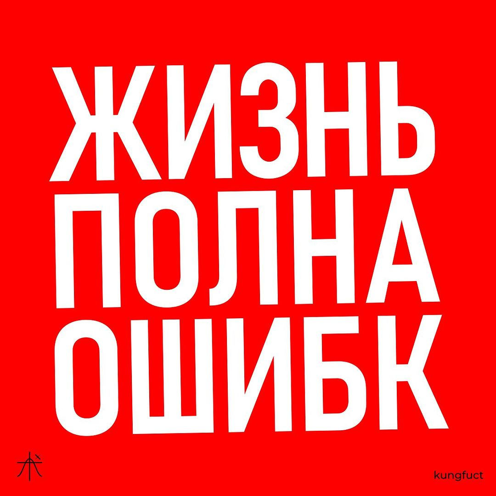

<h1 align="center">Привет, я Макс 👋</h1>
<h3 align="center">Senior QA Engineer (Junior Automation, Java)</h3>

- 🌱 Я изучаю **QA, Java, Agile**
- 💼 Работаю в компании [**Neoflex**](https://www.neoflex.ru/) на проекьк **ВТБ**
- 🧑‍💻 Сейчас я пишу дипломный проект для лучшей школы автоматизации [**QA.GURU**](https://qa.guru/)
- 💬 Помимо тестирования можете у меня спросить про: *бег* 🏃‍♂️ *пеший туризм* 🏔️ *китайский чай* ☕
- 📄 Мой опыт [**Habr Career (draft)**](https://career.habr.com/)

### Мои инструменты и технологии:

### Как со мной связаться:

</a>  

### Дипломные проекты 🎓

